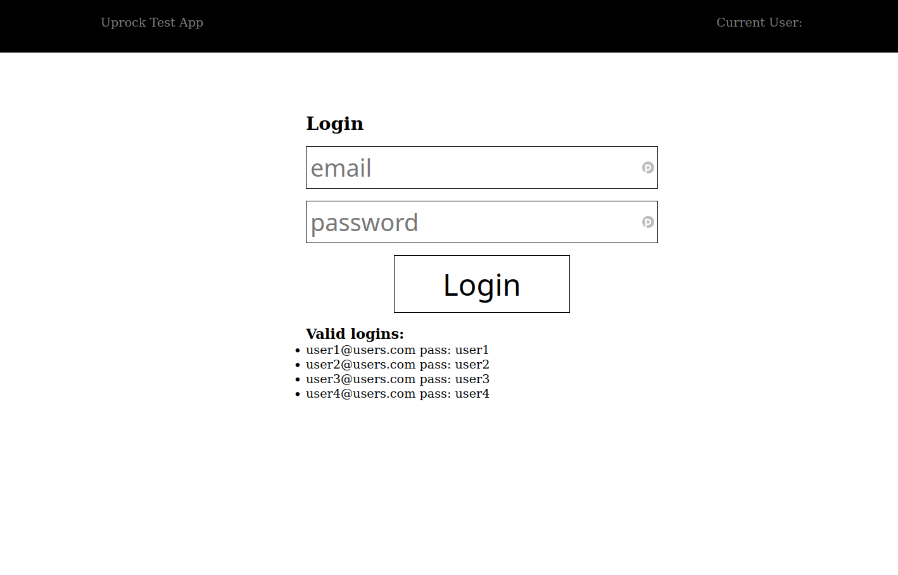
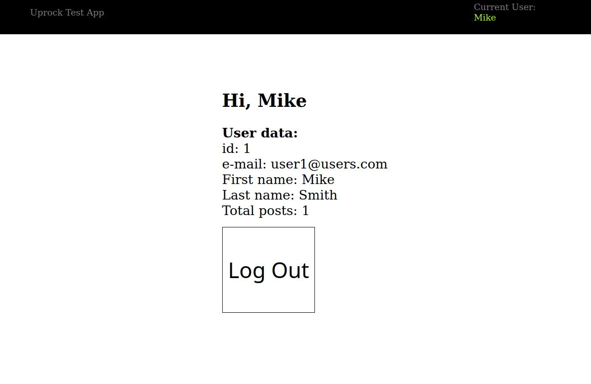

# Uprocktest
This is Uprock test 

There are 3 directories:

1. client - Vue app under Vite js bundler - start with " npm  i " + "npm run dev " 

   PORT 5173

2. server - small sever app with POST "/login" endpoint  - strart with " npm i" + " npm run dev " 

   PORT 7000

3. nodeserver - server with Vue build on board - start with " npm i " + " npm start " 

   PORT 7000

 just clone code. 

Login screen:

Logged in screen: 

